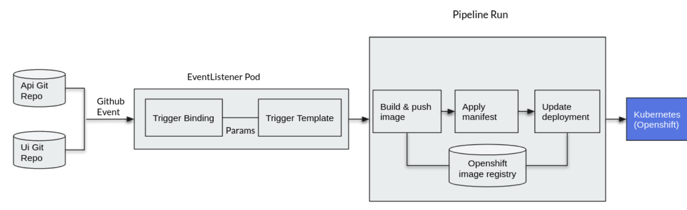

# Openshift Pipelines Demo

## Setup

[Tekton CLI Install](https://access.redhat.com/documentation/en-us/openshift_container_platform/4.7/html/cli_tools/pipelines-cli-tkn)


```
oc new-project pipelines-demo
```

## Create and run a simple task

### Commands

```
oc apply -f tasks/task.yaml

tkn task list

tkn task start --showlog hello
```


## Create and run a pipeline

### Pipeline Diagram


### Create tasks

```
oc create -f tasks/apply_manifest_task.yaml
oc create -f tasks/update_deployment_task.yaml

tkn task ls
```

### Create PVC for workspace and pipelines

```
oc create -f resources/persistent_volume_claim.yaml

oc create -f pipeline/pipeline.yaml

tkn pipeline ls
```

### Run pipeline to build and deploy app backend

```
tkn pipeline start build-and-deploy \
    -w name=shared-workspace,claimName=source-pvc \
    -p deployment-name=pipelines-vote-api \
    -p git-url=https://github.com/openshift/pipelines-vote-api.git \
    -p IMAGE=image-registry.openshift-image-registry.svc:5000/pipelines-demo/vote-api \
    --showlog

```

### Run pipeline to build and deploy frontend

```
tkn pipeline start build-and-deploy \
    -w name=shared-workspace,claimName=source-pvc \
    -p deployment-name=pipelines-vote-ui \
    -p git-url=https://github.com/openshift/pipelines-vote-ui.git \
    -p IMAGE=image-registry.openshift-image-registry.svc:5000/pipelines-demo/vote-ui \
    --showlog
```

```
tkn pipelinerun ls
```


### Get application route

```
oc get route pipelines-vote-ui --template='http://{{.spec.host}}'
```

## Resources

Lab repo this demo was pulled from: https://github.com/openshift-labs/lab-tekton-pipelines

To learn more about OpenShift Pipelines and Tekton, the resources below can provide information on everything from getting started to more advanced concepts.

OpenShift Pipelines Webpage: https://www.openshift.com/learn/topics/pipelines

OpenShift Pipelines Documentation: https://openshift.github.io/pipelines-docs/docs/index.html

Tekton Official Webpage: https://tekton.dev

Tekton Pipelines GitHub: https://github.com/tektoncd/pipeline

Tekton CLI GitHub: https://github.com/tektoncd/cli

For examples of Tekton pipelines and tasks, visit the tektoncd/catalog GitHub repository: https://github.com/tektoncd/catalog